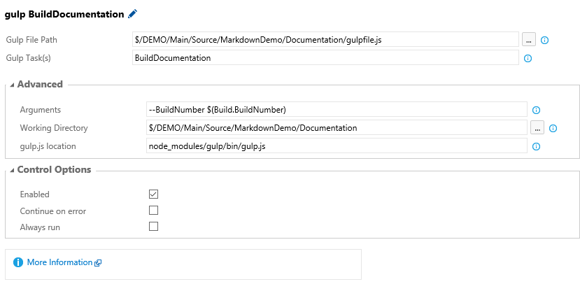
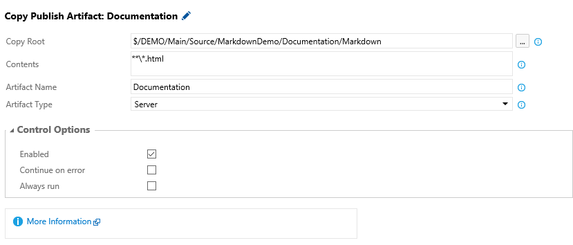

# DocumentationMarkdownToHtml
Use Gulp to convert documentation written in Markdown to HTML

## Step 0 : Prerequisites
I have the following softwares installed on my machine.

* Visual Studio 2015 Update 1
* Visual Studio Code - Insiders
* Node.js
* Gulp

## Step 1 : Create your project
* Create a new project in Visual Studio called *MarkdownDemo*
* Add the files from this GitHub repo to a new *Documentation* folder in the solution folder  
  
* You can add solution folder an add the files in Visual Studio  

## Step 3 : Build the Documentation with Gulp

### Install all node packages
Open a command promt and navigate to the documentation folder.  
`..\Documentation>npm install`  
*Install all npm packages*

### Build the documentation in Dev mode
`..\Documentation>node_modules\.bin\gulp BuildDocumentation`  
*Run the BuildDocumention task with Gulp*  

Open the Test.html file in the Markdown folder in a browser.

  
*In the top right corner the html file is marked as a DevBuid*

  
*Code are highlighted*

### Build the documentation in Release mode
`..\Documentation>node_modules\.bin\gulp BuildDocumentation  --BuildNumber "Version 1.0"`

  
*In the top right corner the html file is marked with the buildnumber Version 1.0*

### Generate the html file when the Markdown file are saved
`..\Documentation>node_modules\.bin\gulp Watch`  
*If you run the **Watch** task and the html file will be generated in Dev Mode every time you save your markdown file* 

## Step 4 : Use VSCode to edit the documentation files
  
*Open the Documentation folder with VSCode*

* Right click on the documentation folder and **Open with Code - Insider**
* Ctrl + Shift + B

  
*The watch task starts*

If you open the html file in Chrome, edit and save the markdown file. Chrome will automatically reload the page.

## Step 5 : Generate the documentation as a part of your build in TFS
  
*Create a new build Definition. Add the npm, Gulp and Copy and Publish Build Artifacts tasks*

  
*Run the install command and set the Working Directory to the Documentation folder*

  
*Run the BuildDocumentation, add the --BuildNumber argument*

  
*Add all html files to the Documentation artifact*

  
*The Documentation artifact is created for Build 20160303.1*

  
*Download and open the Test.html file*

  
*In the top right corner the html file is marked with the buildnumber 20160303.1*

